# KitchenSensor

A system designed to detect when someone is using their kitchen and alert a carer.

## Introduction

This project aims to create a smart home solution for carers of elderly people or people with dementia who are living independently. It was inspired by my grandmother, who often forgets to eat meals and cannot reliably report about how much she has eaten. This device monitors use of the kitchen and sends a daily report by wi-fi to the carer’s email address. It also tweets whenever motion is detected in the kitchen. The carer can use this information to monitor whether the elderly person has used the kitchen to make food, and then make decisions accordingly. In order to create this device, I hypothesised that food preparation in the kitchen space could be accurately measured and reported using this device, which uses motion detection and a temperature/humidity sensor. The research questions needed to test this hypothesis are:

* How many readings of “active” by the PIR motion sensor indicate food preparation?

* What temperature and humidity patterns indicate food preparation?

* How can this information be communicated accurately through ThingSpeak to the carer?

## Approach

### Hardware Development

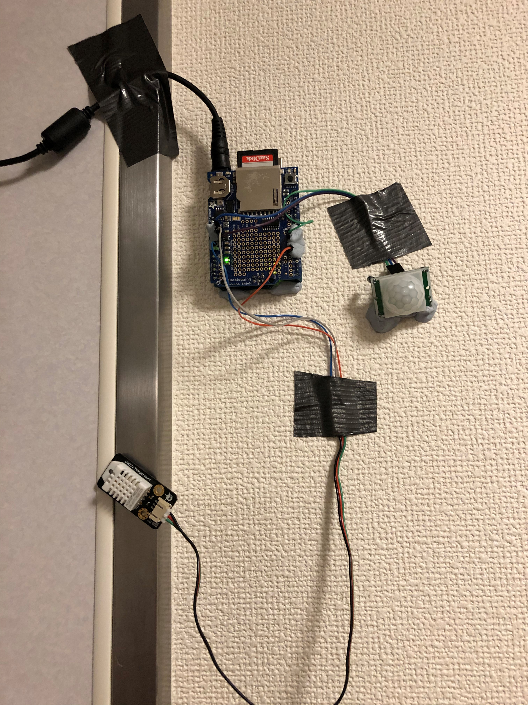

The initial hardware setup is shown in Figure 1. This was used to gather data from the sensors in order to determine thresholds. The data was read from the sensors and stored as a CSV file on the SD card using the attached datalogging shield. However, the datalogging shield did not have heads and it was difficult to get a reliable connection with the sensors.

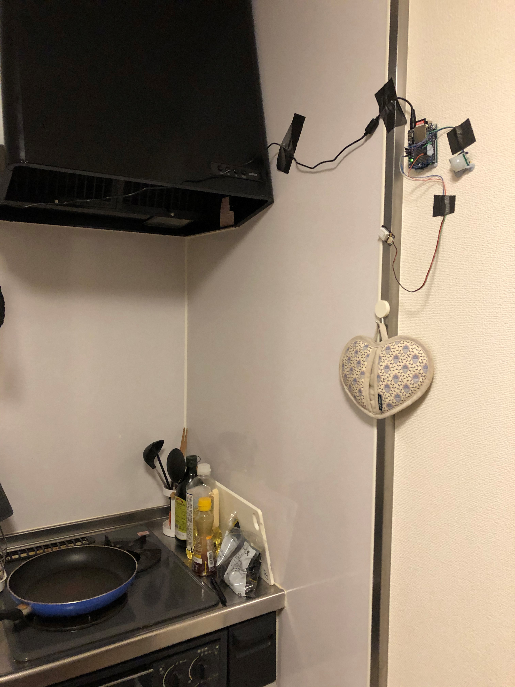

Figure 2 shows the location of the hardware in the kitchen. The temperature and humidity sensor are placed close to the stovetop in order to detect when it is used. The PIR motion sensor is directed towards the rest of the kitchen in order to detect movement near the stove and sink.
 
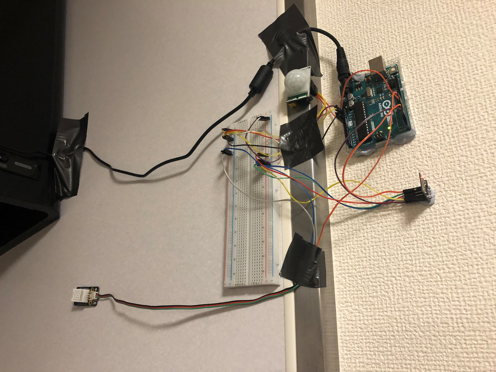

Figure 3 shows the second version of the setup. Initially, it was planned that the Arduino would have a datalogger attached which would be used to store, read and analyse the data. However, given the limited dynamic memory capacity it was determined that using an online service would be a simpler alternative. The datalogging shield was removed, and an ESP-01 Wi-Fi module. This was used to upload the sensor data to ThingSpeak. Adding in the Wi-Fi module necessitated the use of a breadboard.
 
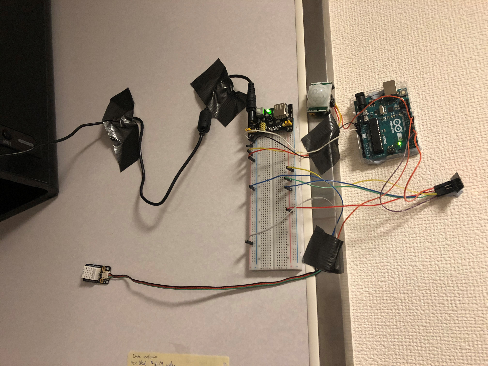

Figure 4 shows the final version of the device. Previously, the setup had problems with power. Due to the insufficient power, sometimes the sensors would stop retrieving data. A power supply was used in order to ensure regular power supply, and a voltmeter was used to select an appropriate supply from the AC adapter (which has variable voltage).

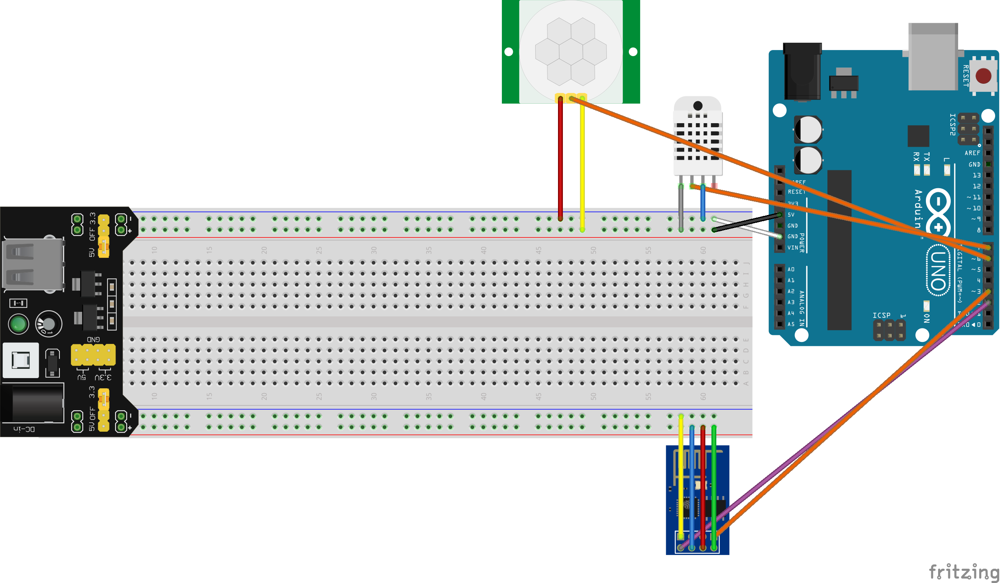

Figure 5 shows a circuit diagram of the final hardware setup. A voltmeter was used to test the 3V and 5V rail and determine if the setup had sufficient power.

### Software Development

#### Arduino controller

The various components are described below in the order the were written. Some were removed as the project evolved, indicated in italics.

1.	Read data from the PIR motion sensor and the temperature/humidity sensor simultaneously

2.	_Logging the data as a CSV file that could be retrieved and analysed_

3.	_Reading data from the CSV and analysing it in arrays_

4.	_Sending emails from the Arduino using an SMTP email service_

5.	Sending sensor data to ThingSpeak at 20 second intervals.

The final version of the controller software is [here](./ArduinoController.ino)

#### ThingSpeak Code
In order to accurately report on the use of the kitchen, several apps had to be built using ThingSpeak’s MATLAB capabilities. 

1.	First, the sensor is sent from the Arduino to ThingSpeak every 20 seconds (free accounts only allow updates every 15 seconds – the extra five seconds is to allow for a margin of error in the timing. 

2.	The temperature and humidity data is read every 20 seconds. 

3.	The motion data is read every second, and then an average is created for each 20 second block. Figure 6 shows an example of the data as it is received by ThingSpeak.

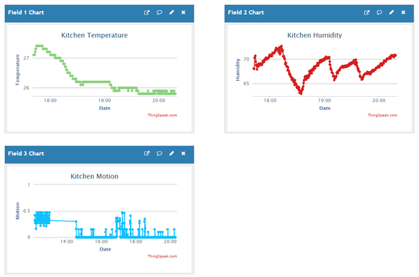

The Kitchen Motion data is measure by a ThingTweet app. This app checks every 10 minutes for a data point greater than 0.3 and then sends a Tweet to a designated Twitter account (see Figure 7). This is designed so the customer can use Twitter to check on their old person they are caring for, or perhaps even share the information with family.

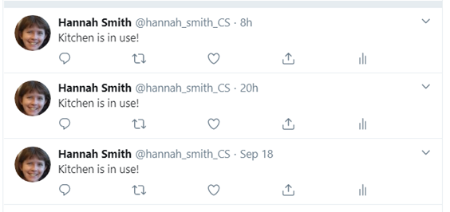

Since the motion data is read every second, it is important not to send the tweets too often. To avoid overreporting the motion data, the data was collected into an average reading for each minute. Since ThingSpeak free accounts only allow for three data sources per channel, I wrote code to process an average for each minute and write it to another channel. Due to the limitation on update frequency, this second channel is updated every 10 minutes using [this](./sensor-average.mat) MATLAB code.

Finally, an app was built in MATLAB to process the data and report it to the customer in a daily email sent at 8pm. This time would need to be adjusted if the user usually has dinner at a later time. In order to not overreport, each kitchen visit detected by the motion sensor triggers a state of “motionDetected” which remains in place until a 0 reading is detected indicating the person left the kitchen. Similarly, a spike in temperature creates a state of “spikeDetected” which remains until the temperature drops. [here](./read-data.mat)

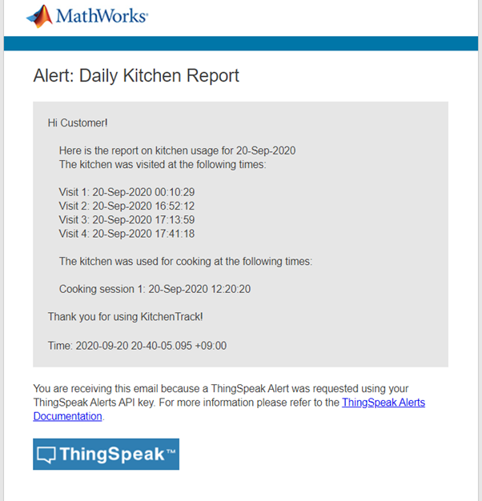

Figure 8 shows an example of the message that the customer would receive every day.

### Validating thresholds and sampling rate

The final stage of the project was to test the prototype system over an extended period. Previously, data collected had been unusable due to the hardware issues described above. In order to verify the data, kitchen visits and cooking were manually recorded using a pen and paper. Once the hardware was working with sufficient reliability the data was analysed in Tableau to determine an initial set of thresholds. Figure 9 shows this initial analysis. The gaps are null values due to the hardware issues. This initial analysis showed a spike in temperature, not humidity, when the stove was used. It also revealed that average motion per minute rather than the raw motion reading was a more accurate picture of the number of visits to the kitchen.

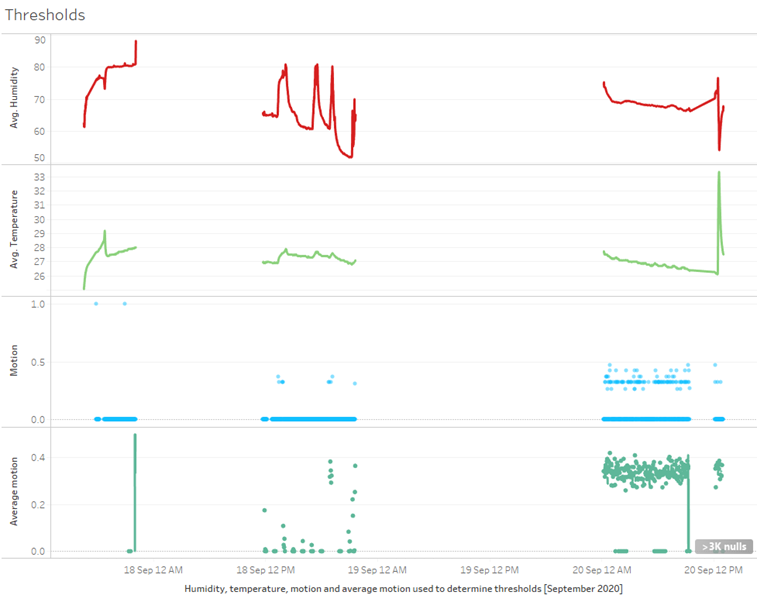

Based on this initial visual analysis, the following rules were created.

1.	Humidity variation does not indicate cooking, but relates more to the environmental condition

2.	Temperature spikes of 3 degrees or more indicate cooking on the stove

3.	A subsequent drop of 1 degree will indicate the cooking has ceased and the cooking event is over

4.	An average motion per minute of greater than 0.2 indicates the kitchen is being used

5.	A subsequent drop to 0 indicates the kitchen visit has finished

## Results

The results after another day of collection are displayed below. This data was cleaned by removing time zone strings from the date stamps. Filtering revealed no anomalous numbers out of range. Figure 11 shows the ThingSpeak report from that day.

Looking at the graph, we can see two more spikes in temperature on the 21st of September at approximately 10 am and 7pm. 

The kitchen visits recorded manually that day were:
| Date	| Time (approx.)	| Activity |
| ----------- | ----------- | ----------- |
|September 21	| 10am |	Fry an egg
| | 2pm |	Use the microwave
| | 7:30pm |	Cooking on the stove
 
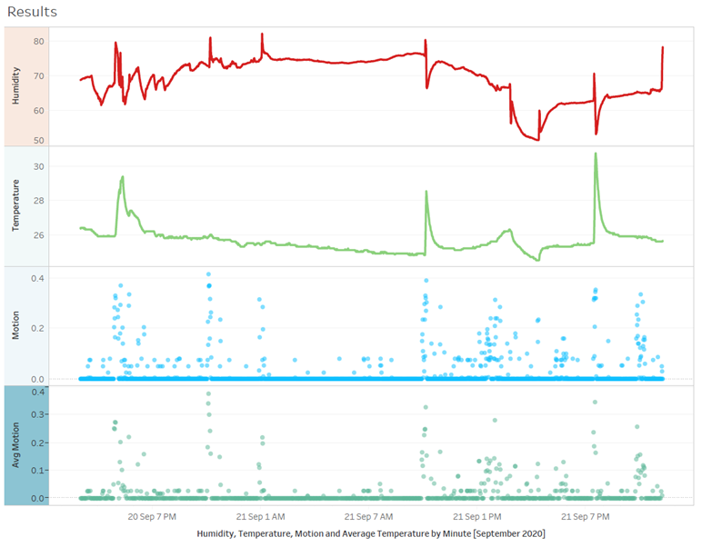

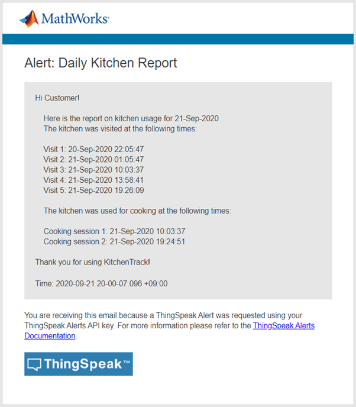

Rule 1 seems to be valid as there were many dips and spike in humidity unrelated to the cooking activities. For example, there is a spike at around 11pm on September 21st. We can see that the spikes in temperature spikes correspond with the times the stove was used, but not the microwave. There was a smaller temperature spike when the microwave was used but further testing would be needed to determine threshold for this. Rule 2 is validated by this data. Rule 3 also holds up as in both cooking events, the temperature returned to the previous baseline temperature quickly, dropping at least 1 degree within 5 minutes.  We can also see that the average motion accurately depicts kitchen visits even when they do not use the stove, validating Rule 4. The motion detection also stopped so dual reports were not sent, validating Rule 5.

## Discussion

### Limitations

This was a preliminary test of a prototype, and therefore these results only reflect one day of data. Given the reliance of the device accuracy on temperature, it would need to be tested over a longer period of time in more extreme temperatures. Currently it is autumn where this data was recorded and the weather is very mild, with little variation between day and night. There is no artificial cooling or heating used in the kitchen, even though that could affect the results. More testing is needed to determine how the device will perform in different environmental situations.

Furthermore, the data collected does not give us any knowledge about how kitchen size affects the data – a larger kitchen may not be accurately measure with a single device. The device was able to be placed directly next to the stove in this kitchen, but different device placements will affect how the sensors read the temperature and humidity changes. Furthermore, food preparation does not necessitate the use of the stove and the use of other appliances and preparation spaces would likely affect the accuracy.

This means that the data collected will always have some degree of ambiguity, necessitating interpretation of the email data from the user. Specifically, they may not be able to understand what constitutes a “visit”. The device also only measures whether a person is in the kitchen or not, regardless of their activities. Someone visiting the kitchen for non-culinary purposes would still register as a visit. Someone preparing a salad for dinner would not register as cooking. In these situations, the results would not accurately reflect the real situation. Further development is needed to create a device that can measure different types of food preparation.

#### Challenges
The primary challenges in this project were accurately gathering and transmission of the sensor data. The preliminary testing of the threshold seems to reveal stove use at least can be accurately measured. However, the efficacy of the program used is entirely dependent on the reliable gathering of data. This device took multiple builds to be able to provide a stable collection of data. The project was always limited by the hardware, so I learned that it is important to complete the hardware development stage and then adapt the software to fit the limitations of the hardware.

#### Ethical concerns

This project required the completion of a Low Risk Ethics Application Form, submitted via email on the 7th of September during the project planning phase. This project used data gathered about humans, and therefore there are issues of handling private data. For the purposes of testing these thresholds, it was necessary to record my daily activities. If this were to be tested on a wide scale, that would require people to give private information about how they spend time at home and the layout of their kitchen. To prevent misuse, it seems necessary to deidentify data when it is uploaded, and to collect kitchen profiles anonymously as well.

If this device was a real product, it would pose an even greater risk to privacy, and so the security capabilities of ThingSpeak would need to be determined. An unsuitable server could mean unauthorised people have access the data. This data could potentially be used to track if someone is home or not in order to plan criminal activity. Therefore, it is essential that the release of the data be tightly controlled. The Twitter option would be done using private accounts, an optional. The email would need to be verified, and any customer accounts would need two-step authentication.

However, the greatest ethical concern is with regards to the target user. Given that the device is designed specifically for people with a mental impairment, it would be necessary to determine ethical standards regarding the use of this device. Although the Information Technology Professionals Association [1] has guidelines, they are quite vague about this specific area of health data. The Australian Human Rights Commission [2] published a report with specific proposals regarding technology and the disabled, but its target audience is policymakers and it is difficult to apply to this specific situation. Further research would be needed, but some preliminary ideas are that the device should in some way indicate its purpose – perhaps through the use of a LED screen that indicates when it is recording data. The device manual would also need to be written with the target user in mind, to make it easy for them to understand its purpose.

## References

[1] 	Information Technology Professionals Association, “Code of Ethics,” 2020. [Online]. Available: https://www.itpa.org.au/code-of-ethics/. [Accessed 24 September 2020].

[2] 	Australian Human Rights Commission, “Human Rights and Technology,” Australian Human Rights Commission, Sydney, Australia, 2019.
